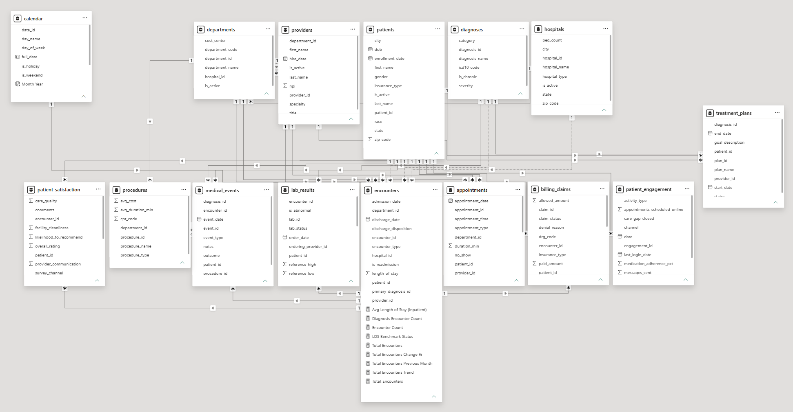
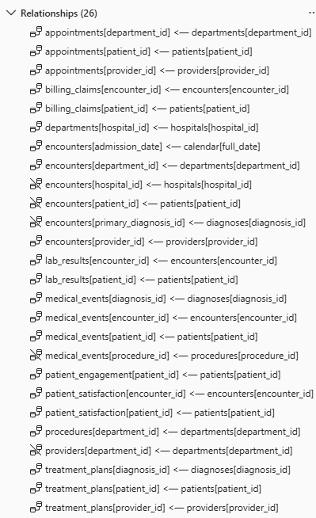

## Data Dictionary — Holistic Health Analytics
*Holistic Health - All names and values are fictional*

15 tables · 150 users · SQLite / PostgreSQL compatible

---

## Table of Contents

- [appointments](#appointments)
- [billing_claims](#billing_claims)
- [calendar](#calendar)
- [departments](#departments)
- [diagnoses](#diagnoses)
- [encounters](#encounters)
- [hospitals](#hospitals)
- [lab_results](#lab_results)
- [medical_events](#medical_events)
- [patient_engagement](#patient_engagement)
- [patient_satisfaction](#patient_satisfaction)
- [patients](#patients)
- [procedures](#procedures)
- [providers](#providers)
- [treatment_plans](#treatment_plans)

## Relationship Summary

---
## Table Definitions

## appointments

Stores appointment scheduling data across providers, departments, and patients. Includes appointment status (scheduled, completed, canceled, no-show), appointment type, and timestamps. Used to analyze access to care, no-show rates, and provider utilization.

## billing_claims

Contains insurance billing and reimbursement data linked to encounters. Includes claim amounts, paid amounts, denial status, and payer information. Used for revenue cycle analysis and claim payment rate calculations.

## calendar

Central date dimension table used for time intelligence across all healthcare metrics. Includes full_date, month, quarter, year, and fiscal attributes. Used for trend analysis and period-over-period comparisons.

## departments

Defines clinical departments such as cardiology, oncology, emergency, and internal medicine. Used to segment providers, encounters, and operational performance by service line.

## diagnoses

Stores standardized diagnosis codes and diagnosis names. Used as a clinical dimension to categorize disease burden, utilization patterns, and condition prevalence across encounters.

## encounters

Primary clinical fact table capturing each patient interaction with the healthcare system. Includes encounter type (inpatient, outpatient, emergency), admission/discharge dates, primary diagnosis, and length of stay. Used for utilization, clinical workload, and outcome analysis.

## hospitals

Contains hospital or facility-level metadata including location, type (acute care, specialty, outpatient), and capacity attributes. Used for facility-level performance and comparative analysis.

## lab_results

Stores laboratory test results for patients across encounters. Includes test name, test panel, result values, and abnormality flags. Used to assess clinical risk, diagnostic trends, and abnormal lab rates.

## medical_events

Captures time-stamped clinical events during patient care such as admissions, transfers, procedures, and alerts. Used to analyze patient journey progression and care pathway timing.

## patient_engagement

Tracks patient interaction with healthcare services outside of clinical encounters, including portal logins, messaging activity, and follow-up adherence. Used to measure engagement and continuity of care.

## patient_satisfaction

Stores patient-reported outcomes and satisfaction survey responses. Includes metrics such as overall experience score, provider communication, wait time satisfaction, and care quality ratings. 

## patients

Central patient demographic table containing age, gender, geographic region, and risk attributes. Used as the primary entity for segmentation and population health analysis.

## procedures

Stores medical procedures performed during encounters. Includes procedure codes, descriptions, and associated costs. Used for procedural volume analysis and clinical utilization tracking.

## providers

Contains healthcare provider information including specialty, department affiliation, and hospital assignment. Used to analyze provider workload, performance, and care distribution.

## treatment_plans

Stores structured care plans assigned to patients, including diagnosis-linked treatment pathways, medications, and follow-up schedules. Used for care continuity tracking and treatment effectiveness analysis.
